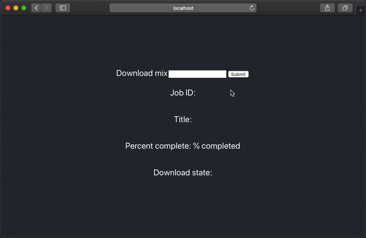

# Mixes
## Download and listen to your mixes



Mixes is a tool that helps you backup your audio mixes in one place with a simple interface to download and listen to all of your mixes.

## Setup
In order to run the codebase, you will need to have `python3` and `redis-server` installed. Instructions assume that you have a virtual environment set up.
```bash
# in one tab
cd backend
pip install -r requirements.txt
python app.py

# in another tab
redis-server

# and in another one
python worker.py
```

Once you install the requirements and run the python app, you will be able to access Mixes through [your browser](http://localhost:5000).

## Development
### Backend
To work with the python backend code, you will need to edit the `app.py` file which is located in `backend`. If you intend to deploy this somewhere, you should **deactivate the debug mode**.

### Frontend
To work with the frontend javascript code, you will need to go into the `frontend` folder and run `npm i` to install the dependencies first.

Next, you can edit the code in `frontend/src`, and then run `npm start` to get a live development server. *It can take a moment to load when you first start, please be patient*.

When you're ready to deploy your changes, you will need to run `npm run build`.

---
Built with ♥️ under quarantine in San Francisco
